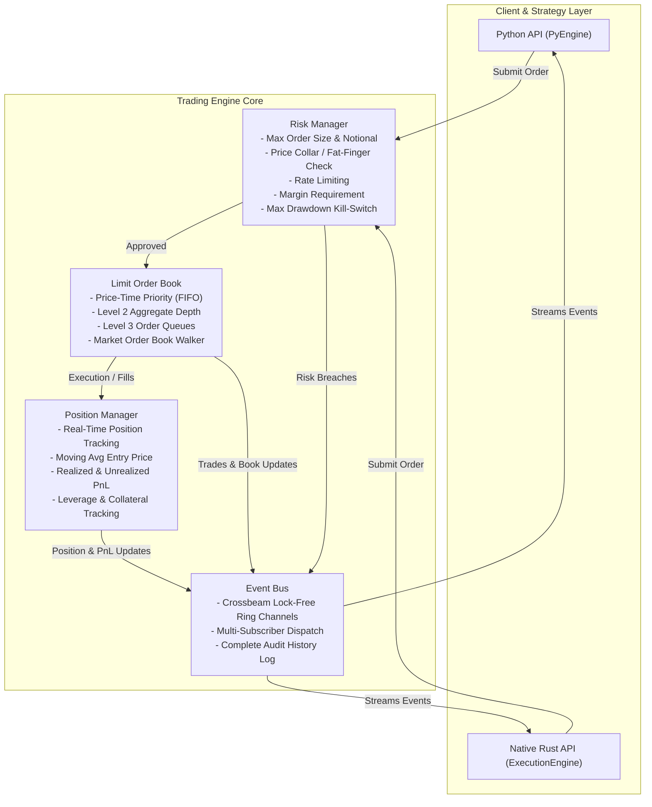

# High-Performance Rust Trading Engine with Python API

[](https://github.com/peter/trading-engine/actions/workflows/ci.yml)
[](https://www.rust-lang.org/)
[](https://www.python.org/)
[](https://pyo3.rs/)
[](https://github.com/astral-sh/ruff)

A modular, low-latency, thread-safe institutional-grade trading and matching engine built in Rust with Python bindings via PyO3.

---

## Architecture Overview



---

## Core Components

### 1. Limit Order Book (`src/order_book.rs`)
- **Price-Time Priority (FIFO)** matching engine.
- Integer price-tick indexing to eliminate IEEE-754 floating-point comparison hazards.
- $O(1)$ order lookup and cancellation via hash index mapping.
- Level 2 market depth generation (top $N$ bids & asks, cumulative quantities, and order counts).
- Supports Limit, Market, GTC (Good 'Til Cancelled), IOC (Immediate Or Cancel), and FOK (Fill Or Kill) orders.

### 2. Event Bus (`src/event_bus.rs`)
- High-throughput asynchronous multi-producer multi-consumer publish/subscribe bus built on `crossbeam-channel`.
- Strongly-typed events: `OrderSubmitted`, `OrderAccepted`, `OrderRejected`, `OrderCancelled`, `OrderFilled`, `TradeExecuted`, `BookUpdated`, `PositionUpdated`, `AccountUpdated`, `RiskBreached`, `SystemAlert`.
- In-memory ring buffer capturing chronological event audit logs.

### 3. Position Manager (`src/position_manager.rs`)
- Multi-asset position tracking per symbol.
- Correct average entry price calculation across scale-ins, partial reductions, and position flips (Long $\leftrightarrow$ Short).
- Real-time realized PnL and Mark-to-Market unrealized PnL.
- Margin accounting (used margin, free collateral, leverage support).

### 4. Risk Manager (`src/risk_manager.rs`)
- **Pre-trade risk pipeline**:
  - `MaxOrderQuantity` and `MaxOrderNotional` safeguards.
  - `MaxPositionNotional` aggregate exposure limits.
  - `PriceCollar`: rejects limit orders that deviate by more than $X\%$ from the prevailing mid price.
  - Rate limiting (sliding-window orders-per-second throttling).
  - Margin verification against available free capital.
- **Post-trade circuit breaker**:
  - Automatically trips engine kill-switch if portfolio drawdown breaches the configured risk limit.
  - Supports manual emergency halts (`trip_kill_switch` / `reset_kill_switch`).

### 5. Execution Engine (`src/execution_engine.rs`)
- Coordinates the complete order lifecycle state machine.
- Routes submissions through risk checks $\rightarrow$ order book matching $\rightarrow$ position updates $\rightarrow$ event broadcasting.

### 6. Correlated Multi-Asset Market Simulator (`src/market_sim.rs`)
- **Correlated Geometric Brownian Motion (GBM)**: Simulates $N$ correlated price trajectories using Cholesky decomposition ($\mathbf{\Sigma} = \mathbf{L} \mathbf{L}^T$) and Box-Muller Gaussian transforms.
- **Market Microstructure**:
  - *Automated Market Makers*: Multi-level quoting ladders dynamically adjusted around prevailing theoretical fair prices.
  - *Noise / Flow Traders*: Poisson arrival process simulating aggressive liquidity-taking market order flow.
- Seamlessly accessible from Python via `MultiAssetMarketSim` and `AssetConfig`.

### 7. Python API (`src/python/` & `trading_engine`)
- Native Python C-extension built with PyO3.
- Idiomatic Python classes: `Engine`, `Order`, `Trade`, `Position`, `Account`, `MarketDepth`, `RiskConfig`.
- Fully typed with PEP 561 marker and clean docstrings.

---

## Quickstart

### Prerequisites
- [Rust](https://www.rust-lang.org/) (stable toolchain)
- [uv](https://docs.astral.sh/uv/) (recommended) or Python 3.11+

### Installation & Build

1. **Install dependencies and compile Python extension module:**
   ```bash
   uv venv
   uv run maturin develop
   ```

2. **Run Python Examples:**
   ```bash
   uv run python examples/basic_trading.py
   uv run python examples/market_maker.py
   ```

3. **Run Native Rust Standalone CLI Demo:**
   ```bash
   cargo run --bin trading-engine-cli --no-default-features
   ```

---

## Python Usage Example

```python
from trading_engine import Engine, RiskConfig

# Configure risk limits
risk = RiskConfig(
    max_order_qty=100.0,
    max_order_notional=500_000.0,
    max_position_notional=1_000_000.0,
    price_collar_pct=0.05,  # 5% price collar
    max_drawdown_pct=0.20,
)

# Initialize engine with $100,000 cash balance and 2x leverage
engine = Engine(initial_balance=100_000.0, leverage=2.0, risk_config=risk)
engine.register_symbol("BTC-USDT", tick_size=0.50, lot_size=0.001)

# Submit resting limit orders
engine.submit_order("BTC-USDT", "BUY", "LIMIT", 60_000.0, 1.0)
engine.submit_order("BTC-USDT", "SELL", "LIMIT", 60_100.0, 1.0)

# Inspect Order Book depth
depth = engine.get_depth("BTC-USDT", levels=5)
print(f"Mid Price: ${depth.mid_price():,.2f} | Spread: ${depth.spread():,.2f}")

# Submit market taker order
order = engine.submit_order("BTC-USDT", "BUY", "MARKET", 0.0, 0.5, "IOC")
print(f"Filled: {order.filled_quantity} BTC")

# Inspect Position and Account
pos = engine.get_position("BTC-USDT")
print(f"Position: {pos.quantity} BTC @ avg ${pos.avg_entry_price:,.2f}")

# Poll real-time events
events = engine.poll_events()
```

---

## Correlated Multi-Asset Simulation Example

```python
from trading_engine import AssetConfig, Engine, MultiAssetMarketSim

engine = Engine(initial_balance=500_000.0)

# Configure correlated asset universe
btc = AssetConfig("BTC-USDT", initial_price=60_000.0, drift=0.03, volatility=0.45)
eth = AssetConfig("ETH-USDT", initial_price=3_000.0, drift=0.03, volatility=0.55)

# Correlation matrix
correlation = [
    [1.0, 0.85],
    [0.85, 1.0],
]

# Initialize simulator
sim = MultiAssetMarketSim(engine, [btc, eth], correlation, seed=42)

# Step market 100 times (1 second intervals)
for _ in range(100):
    prices = sim.step(dt=1.0)
    btc_depth = engine.get_depth("BTC-USDT")
    eth_depth = engine.get_depth("ETH-USDT")
```

---

## Testing & Quality Assurance

### Rust Unit & Integration Tests
```bash
cargo test --no-default-features --all-targets
```

### Python Linting & Formatting (Ruff)
```bash
uv run ruff check .
uv run ruff format --check .
```

### Python Integration Tests (Pytest)
```bash
uv run pytest tests/
```

---

## License
MIT
